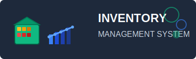

<div align="center">
  

  # Inventory Management System

  [](https://laravel.com)
  [](https://php.net)
  [](https://mysql.com)
  [](https://tailwindcss.com)
  [](https://opensource.org/licenses/MIT)

  > A comprehensive, modern inventory management solution built with Laravel 12, designed for businesses of all sizes to efficiently track products, manage stock levels, and streamline operations.

  [📋 Features](#features) • [🚀 Quick Start](#quick-start) • [📖 Documentation](#documentation) • [🤝 Contributing](#contributing) • [📄 License](#license)
</div>

---

## 🌟 Key Features

### Core Functionality
- **📦 Product Management** - Complete product lifecycle management with categories, SKUs, and detailed tracking
- **👥 Multi-User Role System** - Granular permissions for Admin, Manager, and Staff roles
- **🏢 Customer Management** - Comprehensive customer database with order history and preferences
- **🏭 Supplier Management** - Track suppliers, manage relationships, and monitor supplier performance
- **📋 Purchase Orders** - Streamlined procurement process with approval workflows
- **💰 Sales Management** - Point-of-sale functionality with transaction tracking
- **📊 Advanced Analytics** - Real-time dashboards with key performance indicators
- **🚨 Smart Alerts** - Automated low-stock notifications and expiry warnings

### Advanced Features
- **📈 Production Dashboard** - Monitor manufacturing processes and material usage
- **📊 Expense Tracking** - Comprehensive financial management and reporting
- **🔄 Monthly Reports** - Automated monthly expense and inventory reports
- **📱 Responsive Design** - Fully responsive interface for desktop and mobile
- **🔒 Security First** - Laravel Sanctum authentication with secure API endpoints
- **📄 PDF Generation** - Export reports and invoices as PDF documents
- **☁️ Offline Support** - SQLite compatibility for offline deployments

---

## 🛠️ Technology Stack

### Backend
- **Laravel 12.0** - Modern PHP framework with expressive syntax
- **PHP 8.2+** - Latest PHP features for optimal performance
- **MySQL 8.0+** - Robust relational database (SQLite compatible)

### Frontend
- **Tailwind CSS 4.0** - Utility-first CSS framework for rapid UI development
- **Bootstrap 5.2** - Responsive UI components and layouts
- **Vite** - Lightning-fast build tool for modern web development
- **Axios** - HTTP client for seamless API communication

### Development Tools
- **Composer** - PHP dependency management
- **NPM** - Node.js package management
- **Laravel Sail** - Docker development environment
- **Laravel Pail** - Enhanced logging and debugging

---

## 🚀 Quick Start

### Prerequisites
- PHP >= 8.2
- Composer
- Node.js 18+ & NPM
- MySQL 8.0+ or MariaDB 10.3+

### Installation

1. **Clone the repository**
   ```bash
   git clone https://github.com/kyawhla-commit/inventoryProject.git
   cd inventoryProject
   ```

2. **Install PHP dependencies**
   ```bash
   composer install
   ```

3. **Install Node.js dependencies**
   ```bash
   npm install
   ```

4. **Environment configuration**
   ```bash
   cp .env.example .env
   php artisan key:generate
   ```

5. **Database setup**
   ```bash
   # Configure your database in .env file
   php artisan migrate --seed
   php artisan storage:link
   ```

6. **Build assets and start development server**
   ```bash
   npm run build
   php artisan serve
   ```

7. **Access the application**
   Open [http://localhost:8000](http://localhost:8000) in your browser

### Default Credentials
- **Admin**: `admin@example.com` / `password`
- **Manager**: `manager@example.com` / `password`
- **Staff**: `staff@example.com` / `password`

---

## 📖 Documentation

### User Guides
- [📋 Installation Checklist](INSTALLATION_CHECKLIST.md)
- [📊 Production Dashboard Guide](PRODUCTION_DASHBOARD_IMPLEMENTATION.md)
- [📈 Monthly Reports Guide](MONTHLY_EXPENSES_GUIDE.md)
- [🔧 Implementation Summary](IMPLEMENTATION_SUMMARY.md)

### API Documentation
- [📡 Complete API Reference](API_DOCUMENTATION.md)
- RESTful API endpoints for all major operations
- Authentication via Laravel Sanctum
- Comprehensive request/response examples

### Development
- [🏗️ Files Summary](FILES_SUMMARY.md)
- [✅ Implementation Success Guide](IMPLEMENTATION_SUCCESS.md)

---

## 🏗️ Architecture

### Project Structure
```
inventoryProject/
├── app/                 # Application code
│   ├── Http/Controllers # Request handlers
│   ├── Models          # Eloquent models
│   └── Services        # Business logic
├── database/           # Migrations and seeders
├── public/             # Public assets
├── resources/          # Views and frontend assets
├── routes/             # API and web routes
└── storage/            # File storage
```

### Database Design
- **Normalized schema** with proper relationships
- **Migration-based** database versioning
- **Seeded with sample data** for immediate testing
- **Supports multiple database backends** (MySQL, SQLite, PostgreSQL)

---

## 🔧 Configuration

### Environment Variables
```env
APP_NAME="Inventory Management System"
APP_ENV=local
APP_KEY=base64:generated-key
APP_DEBUG=true
APP_URL=http://localhost

DB_CONNECTION=mysql
DB_HOST=127.0.0.1
DB_PORT=3306
DB_DATABASE=inventory
DB_USERNAME=your-username
DB_PASSWORD=your-password

BROADCAST_DRIVER=log
CACHE_DRIVER=file
QUEUE_CONNECTION=sync
SESSION_DRIVER=file
```

### Additional Configuration
- **Queue workers** for background processing
- **Mail configuration** for notifications
- **Storage settings** for file uploads
- **Broadcasting** for real-time updates

---

## 🚢 Deployment

### Production Deployment
1. **Environment setup**
   ```bash
   APP_ENV=production
   APP_DEBUG=false
   APP_URL=https://yourdomain.com
   ```

2. **Database optimization**
   ```bash
   php artisan config:cache
   php artisan route:cache
   php artisan view:cache
   ```

3. **Web server configuration**
   - Configure Nginx/Apache for Laravel
   - Set up SSL certificates
   - Configure proper file permissions

### Offline Deployment
- **SQLite support** for single-file databases
- **Docker containers** for easy distribution
- **Portable bundles** for Windows deployment

---

## 🤝 Contributing

We welcome contributions! Please see our [Contributing Guide](CONTRIBUTING.md) for details.

1. Fork the repository
2. Create your feature branch (`git checkout -b feature/amazing-feature`)
3. Commit your changes (`git commit -m 'Add amazing feature'`)
4. Push to the branch (`git push origin feature/amazing-feature`)
5. Open a Pull Request

### Development Workflow
- **Feature branches** for new functionality
- **Pull requests** with detailed descriptions
- **Code review** before merging
- **Testing** on all branches

---

## 📊 Performance

### Optimization Features
- **Database indexing** for fast queries
- **Caching strategies** for improved response times
- **Asset optimization** with Vite bundling
- **Lazy loading** for better user experience

### Monitoring
- **Laravel Pail** for enhanced logging
- **Performance metrics** tracking
- **Error monitoring** and reporting

---

## 🔒 Security

### Security Measures
- **CSRF protection** on all forms
- **SQL injection prevention** via Eloquent ORM
- **XSS protection** with proper escaping
- **Secure authentication** with Laravel Sanctum
- **Input validation** on all requests
- **Rate limiting** for API endpoints

### Best Practices
- **Environment-based configuration**
- **Secure password hashing**
- **Session management**
- **File upload restrictions**

---

## 📄 License

This project is licensed under the **MIT License** - see the [LICENSE](LICENSE) file for details.

---

## 🙏 Acknowledgments

- **Laravel Team** for the amazing framework
- **Tailwind CSS** for the utility-first styling
- **Open Source Community** for continuous inspiration
- **Contributors** who help improve this project

---

<div align="center">

**Built with ❤️ using Laravel 12**

For support, email [bwarpay.bp8@gmail.com](mailto:bwarpay.bp8@gmail.com) or create an issue on GitHub.

⭐ **Star this repository if you find it helpful!**

</div>

